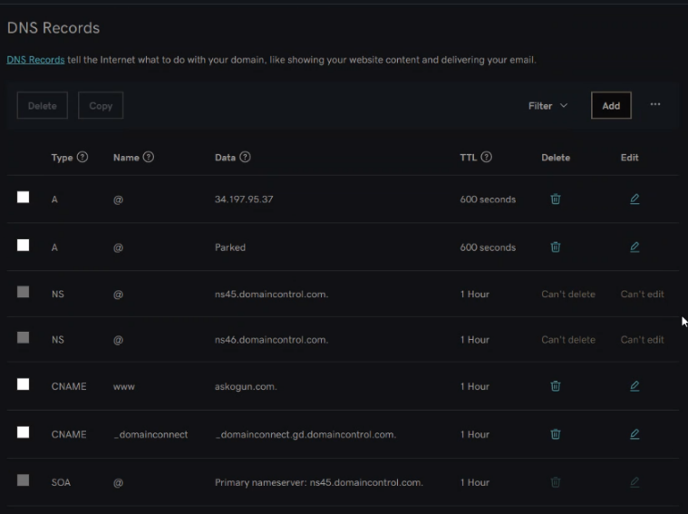

## LOAD BALANCER WITH NGINX AND SLS/TLS

This project aims to configure Nginx as a load balancer and register a new domain name and configure secured connection using SSL/TLS certificates. The cloud architecture is as shown below:


I created an EC2 Ubuntu server 20.04 instance and named it Nginx-lb and opened up port 80 and port 443.


I installed and configured Nginx as a load balancer. I updated /etc/hosts file for local DNS with web server's name: web1 and web2 as well their local IP address.


I added the necessary configuration into the http section in /etc/nginx/nginx.conf file. Afterwards, I restarted nginx  

```bash
    #insert following configuration into http section

 upstream myproject {
    server Web1 weight=5;
    server Web2 weight=5;
  }

server {
    listen 80;
    server_name www.domain.com;
    location / {
      proxy_pass http://myproject;
    }
  }

#comment out this line
#       include /etc/nginx/sites-enabled/*;
```


I obtained a new domain name and assigned an elastic IP to my nginx-lb server and associated my domain name with the elastic IP by updating the A record in my registrar to point to nginx-lb using the elastic IP.




I configured nginx to recognize my new domain name by including it in nginx.conf file.


I installed certbot and requested for an SSL/TLS certificate and also made sure snapd service was up and running.

```bash
    sudo systemctl status snapd
    sudo snap install --classic certbot
```

I requested for my certificate by following the certbot prompt.


